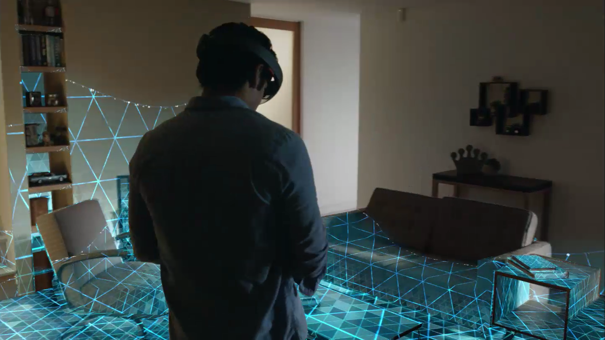
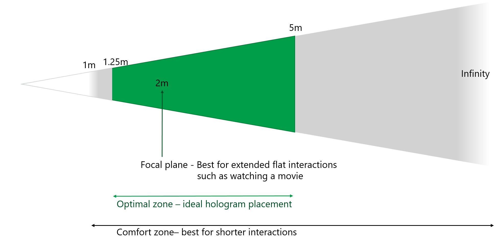

# HoloRenault

- [Introduction](#introduction)
- [Functionalities](#functionalities)
  - [Mapping the environment](#mapping-the-environment)
  - [Displaying an asset in Unity Store](#displaying-an-asset-in-Unity)
  - [Unity Store](#unity-Store)
  - [Independent movement of objects](#independent-movement-of-objects])
  - [Object scaling](#object-scaling)
  - [Creating an object from a menu](#creating-an-object-from-a-menu)
- [Encountered difficulties](#encountered-difficulties)
  - [Room complexity](#room-complexity)
  - [New technology](#new-technology)
- [Limitations of the headset](#limitations-of-the-headset)
  - [Assets limits](#assets-limits)
  - [Difficulties to display complex assets](#difficulties-to-display-complex-assets)
  - [Field of view](#field-of-view)
- [Possible improvements](#possible-improvements)
  - [Assemble multiple assets](#assemble-multiple-assets)
  - [Have a modified asset](#have-a-modified-asset)

## Introduction

The Microsoft Hololens. The new mixed reality headset developed by Microsoft was brought in 2016 to the developers scene to offer a new platform for innovation.
As our 4th year engineering project, we decided to take that road to work with Actimage, a digital transformation expert group and work on a new technology that marries the virtual to the real world.

*Mixed reality (MR), sometimes referred to as hybrid reality, is the merging of real and virtual worlds to produce new environments and visualizations where physical and digital objects co-exist and interact in real time.
Mixed reality takes place not only in the physical world or the virtual world, but is a mix of reality and virtual reality, encompassing both augmented reality and augmented virtuality via immersive technology.*

*- [Wikipedia](https://en.wikipedia.org/wiki/Mixed_reality)*

Focused on innovation, we contacted several companies to show how mixed reality could benefit workers working on an industrial level.
We focused our research on the automobile industry and got a contact: with the Quality Roadmap Team Leader at Renault who was interested in this new technology.
We met at the Microsoft Experiences ’17 in Paris and outlined the needs of the company.
We came to conclusion that it would greatly benefit Renault to have a way to virtually visit a factory to not only train the workers but also record the environment and be able to share it to other workers in other factories.
Today companies are faced with a real problem. Assembly lines need to be optimized to guarantee security, and productivity.
That means that our idea could be deployed for other companies in the automobile industry as well as other companies in different domains.
For safety procedures, it would first greatly reduce the time for safety inspections.
A proper placement of the machines is essential.
To fulfill the demand, we developed an application to enable us to modify in real time, the placement of the machines and visualize them while they are running.
We used and applied our engineering knowledge to build our team and the work around the project. Since this technology is still very new to the scene, a good part of our work  consisted in applying the principles of science and problem solving to move forward.
Today, after a year of research we are sharing our experience with the community providing a solid base of information to future developers.


## Functionalities
### Mapping the environment

*Spatial mapping provides a detailed representation of real-world surfaces in the environment around the HoloLens, allowing developers to create a convincing mixed reality experience.*

*- [Microsoft](https://docs.microsoft.com/en-us/windows/mixed-reality/spatial-mapping)*



Most if not every application developed for Hololens will require ```SpatialMapping```.
It is an existing functionality that we only need to add to our application.
When opening the app the headset will make a first mapping of the environment.
In our application, tapping an asset to move it reveals the drawn mesh showing the user where the asset can be placed.

With the latest versions of the HololToolkit, it is possible to tweak the precision of the mesh by adjusting the numbers of triangles for the spatial mapping ```TrianglesPerCubicMeter```
As explained in [Hologram 230](https://docs.microsoft.com/en-us/windows/mixed-reality/holograms-230) triangles can be added and removed to the mesh.


### Displaying an asset from Unity Store


### Independent movement of objects
As the main goal of the project was the set up of Renault's machines in a factory, one of the key feature of the app was the possibility to select an hologram, and to put it wherever the user wanted. For that, we used scripts given on the "HololToolkit", the script "TapToPlace". In order to use this script, we have to have on the Unity scene a Gaze Manager, a Gesture Manager and a spatial mapping. This script is allowing us to then select an asset or hologram, and to put it wherever the mapping is detecting something.

### Object scaling
Object scaling is an essential feature.
When there is no need for simulation, for example during a presentation, it is most useful to have a smaller model to act and present around.

In MS Visual Studio to scale an object you need to create a Vector3 as we are working in 3 dimensions.
It takes three float arguments.
To keep accurate information using fractal number, simply add (float) to the variable.

### Creating an object from a menu
In order to set up the factory, our application should have the possibility to instanciate new assets on the scene. For that, we added a button "Add Asset" in a menu, which allows the user to create a new hologram in front of him whenever he is air tapping the button. This hologram is defined in the component panel of the button.
The following video on [Youtube](https://www.youtube.com/watch?v=J7vCS75DC6w) is a demonstration of our app, with simple assets :


## Encountered difficulties
### Room complexity
During the development of our application, we tested the Hololens in different environment, from a small classroom to an open space to, an even bigger, factory.
Observations show that mapping varies a lot depending on the spacious variable as well as the materials in the surroundings.
The headset struggles in small room as our options of spatial mapping are limited.
Having furniture play a role as well.
Different elevations creates differences in the mapping and the Hololens is not immune to errors.
Dark objects or walls reflect less light and have a tendency to mess with the spatial mapping as well.
The results of these errors create discontinuities in the mesh.
Some holes may appear in the mapping and affect object placement as the environment is not recognized.

### New technology
We encountered different types of problems that we tried to solve together. We couldn't find all the answers on the web as the technology is so recent. So a big part of of work was to understand how the device works and try on our own.


## Limitations of the headset
### Assets limits
Let's start with a quick rundown of the specs.
The headset is packing a custom Microsoft Holographic Processing Unit (HPU 1.0) with an Intel 32-bit architecture CPU.
It is equipped with 2GB of RAM and 64GB of flash storage.
It has a hard limit of 900MB for memory allocation.

It is very important to keep applications light enough to maintain 60 frames per second and ensure a comfortable experience.
It is as important to minimize eye-strain and to do that, assets need to be placed in what we call the comfort-zone.
In fact, Microsoft Windows Mixed Reality Academy recommends to change the value of the Near Clip Plane field from the default 0.3 to 0.85, which equates to 0.85 meters.
This is to reduce discomfort experienced when having a hologram too close to the user.




### Difficulties to display complex assets
During our project we used assets with great complexity with over 8 million polygons.
These type of assets are too large for the headset to compute.
Ideally, we found assets need to be 100'000 polygons or lower to properly be handle by the headset.

In tis case,a good software would be Simplygon:

*Simplygon is a 3D computer graphics software for automatic 3D optimization, based on proprietary methods for creating level of detail (LODs) through Polygon mesh reduction and other optimization techniques.*

*- [Wikipedia](https://en.wikipedia.org/wiki/Simplygon)*

However, a simplification from 8M to 100k is a lot to ask, results were not satisfying as polygons were very irregular.
A better way to do this is to first manually simplify the model by deleting unnecessary details invisible from the exterior.
This would greatly improve the simplification process by the software.

### Field of view
Microsoft says the headset covers 35% of the field of view of the user which greatly impacts ease to move around the environment.
It forces to the user to move their head more often and results to the appearance of neck pain more quickly.
Placing one hologram usually fills the field of view and limits the capabilities of the application.
The biggest drawback is when using large assets of 3 or 4 meters wide.
Already limited by the performance of the headset; the experience is less immersive as the user finds himself inside the asset.

## Possible improvements
### Assemble multiple assets
Models provided by Renault were too large for a One to One scale.
Testing in a small room resulted in the user not moving properly around the asset.
For instance, in a smaller room while the user moves forward in reality, the position in the virtual world did not change and sometimes led to experience a feeling of moving against the direction wanted.
This is explained by the imposing size of the asset.
Being larger than 5 meters wide, the headset struggles to relay the feeling of reality to the user.

An easy fix would be to re-dimension the asset to make it around 4 meters wide, but that would compromise the purpose of using mixed reality as it would mess with the true dimensions and ultimately  stripping away the 'reality' variable.
Another solution would be to cut through the model.
Now as it may work on some machines, it would denaturalize the model once again impacting the immersive experience.

A better solution that would minimize the impact of the user experience while enhancing the benefits of the technology would be to rebuild the machine with the headset.
Let's take an employee in the automobile industry.
By adding parts of the machine to the environment, he would with every addition contribute to the final assembly.
It is an opportunity to interact individually with each part and learn about the functionalities in the process.

### Have a modified asset
